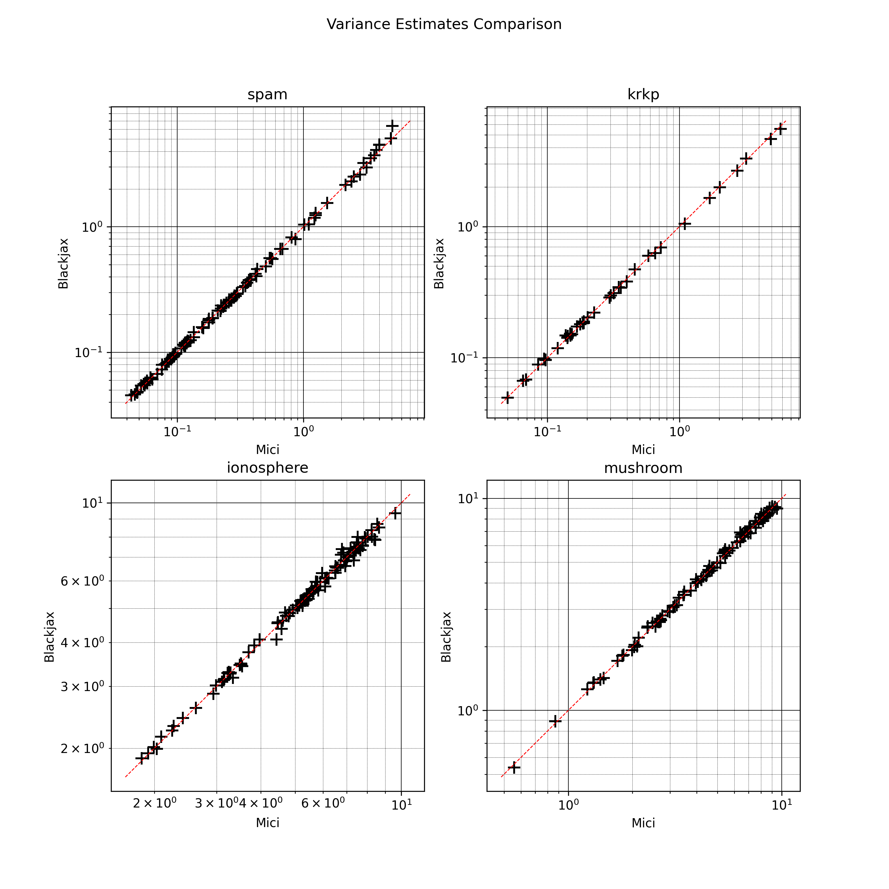
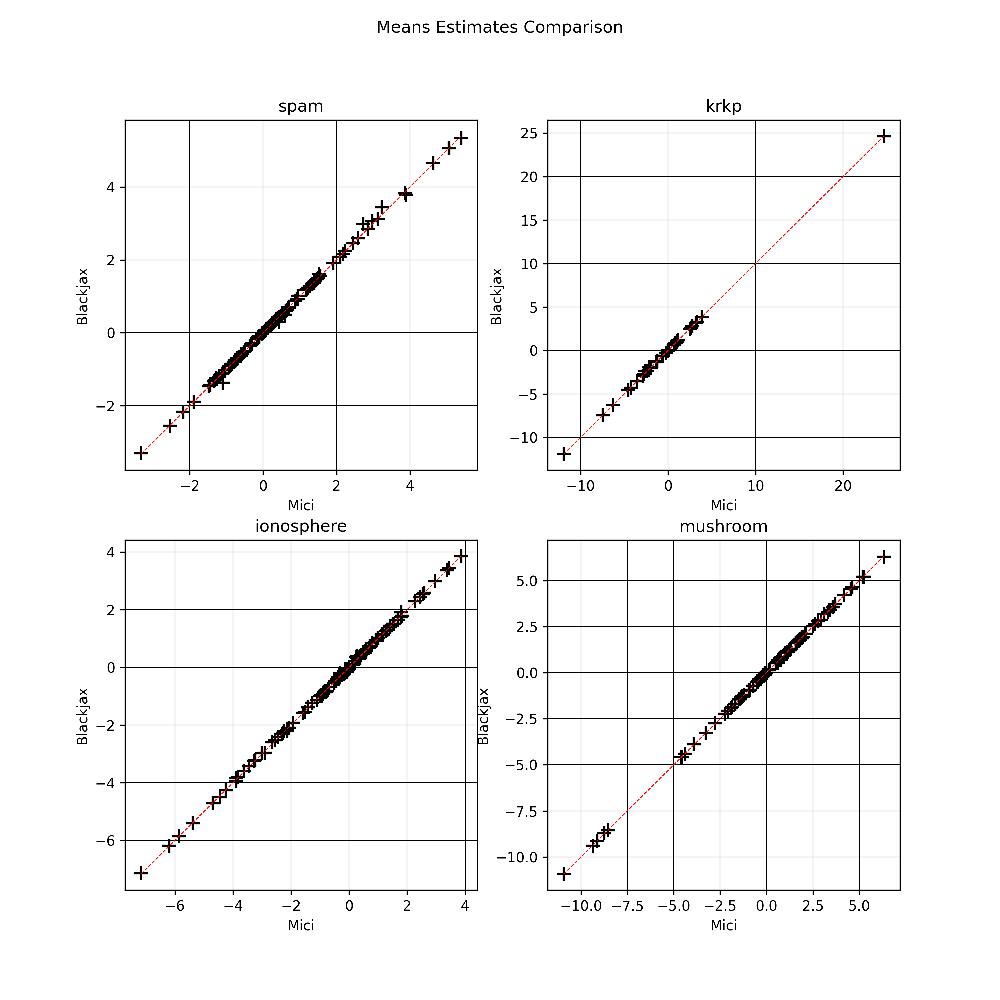

## Scripts for the regression examples

* `preprocess_data.ipynb`: Downloads the data and preprocesses it. Results are stored in numpy files.
* `regression_logdensity.py`: Defines the posterior log-density function for the regression model.
* `regression_HMC_mici.py`: Runs mici's HMC sampler on the regression model.
* `regression_HMC_blackjax.py`: Runs Blackjax's HMC sampler on the regression model.

**Remark**: The HMC outputs are stored in the `.\mcmc_output\` folder.

## Sanity check

The plot below compares the marginal variances obtained by running `mici` and `blackjax` on the regression model.

The plot below compares the marginal means obtained by running `mici` and `blackjax` on the regression model.

